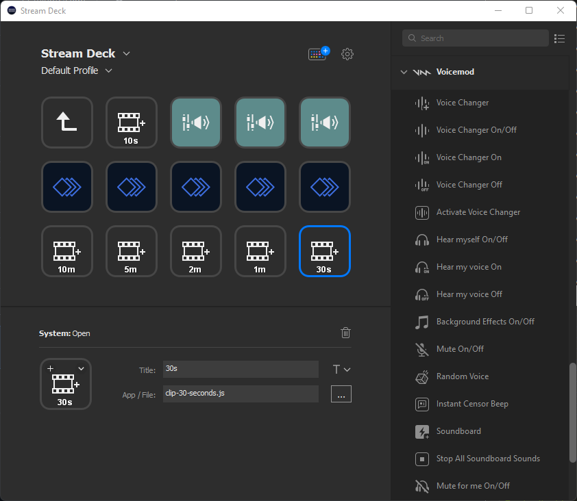

Press a button to clip the last `x` seconds of the currently running OBS stream.
___

## Setup

### OBS
1. Setup OBS so that it is recording to an MKV format.

### .env
1. Create a file in this folder called `.env`.
2. Copy the contents of `.env.example` into your `.env` file.
3. In your `.env`, change the value of `MKV_FOLDER` to what you have in OBS.

### Stream Deck
1. Add the System>Open action to the grid.
2. Click on the file selector for "App / File".
3. Select one of the `clip-x-min.js` files.
